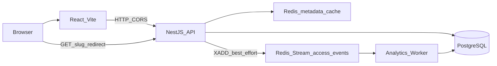

# System Design

Architecture **actually implemented** in this repository. Contract details and longer trade-offs live in the [README](../../README.MD) and the [ADRs](../adr/).

## Overview

PostgreSQL (source of truth):

- `links` — metadata + `clickCount`
- `access_events` — individual facts (`eventId` UNIQUE)
- `daily_link_stats` — daily aggregates per link

Redis:

- cache-aside `link:{slug}` (metadata **without** `clickCount`)
- Stream `access_events` + consumer group `analytics-workers`
- rate limit for `POST /links`

Compose processes: `web`, `api`, `worker`, `postgres`, `redis`.

## Critical Path

`GET /:slug` is the hot path:

1. Redis cache lookup (miss → PostgreSQL → set cache).
2. Validate `active` / `expiresAt` / existence.
3. **Unlimited:** authorize without a synchronous counter write; enqueue analytics; `302`.
4. **Capped:** atomic `UPDATE` in PostgreSQL; success → enqueue with `preCounted`; otherwise `410`.
5. Response `302 Found` (never permanent).

The redirect **does not wait** for analytics persistence.

## Cache Strategy

- Metadata cache-aside to reduce pressure on PostgreSQL for hot links.
- PostgreSQL remains the source of truth for metadata and for `maxClicks` / `clickCount`.
- `PATCH` disable: update PostgreSQL and **DEL** the key (immediate invalidation).
- TTL helps performance; it is **not** the correctness mechanism for disable.

## maxClicks

See [ADR-002](../adr/002-maxclicks-postgresql-authority.md).

- Capped links: enforcement only in PostgreSQL (`clickCount < maxClicks` + active/expiry).
- Redis is **not** the limit authority.
- Unlimited: no such `UPDATE` on the hot path; the worker increments `clickCount` after the event.

## Analytics

See [ADR-003](../adr/003-analytics-redis-streams.md) and [ADR-001](../adr/001-access-stats-aggregation.md).

- The redirect publishes to the Stream (best-effort, non-blocking by default).
- Worker: consumer group → idempotent transaction (`eventId`) → `AccessEvent` + `DailyLinkStat` (+ `clickCount` when not `preCounted`) → **ACK after COMMIT**.
- At-least-once after acceptance; dedup by `eventId`.
- Poison → DLQ after the maximum number of attempts.
- Stats and totals can reflect **eventual consistency** while the worker catches up.

## Statistics

`GET /links/:slug/stats` (PostgreSQL only, no Redis):

1. `Link` by slug → `totalClicks` = `clickCount` (never `COUNT(AccessEvent)`).
2. `DailyLinkStat` in the 7-day UTC window + zero-fill.
3. `AccessEvent` `ORDER BY accessedAt DESC LIMIT 20`.

`GET /links` lists the 50 most recent links (`createdAt DESC`) for the UI.

## Rate Limiting

Only `POST /links`, fixed window in Redis per IP. Redis down → **fail-open** on create. `GET /:slug` is not limited.

## Failure Behavior

### Cache failure

Redis unavailable for **metadata** reads/writes (`link:{slug}`):

- the API **falls back to PostgreSQL** when applicable (a cache miss or cache error does not invent a second authority);
- PostgreSQL remains the **source of truth** for metadata and availability rules.

Disable still requires Redis invalidation when possible; a `DEL` failure after PostgreSQL `active=false` → `503` (retry does not re-enable).

### Analytics enqueue failure

Failure to publish the access event to the Redis Stream:

- **does not block the redirect** — the `302` stays the priority path;
- conscious decision: logging/analytics must not compromise hot-path latency or availability.

Events **accepted** by the Stream:

- asynchronous processing by the worker (consumer group);
- `eventId` provides idempotency in PostgreSQL;
- ACK happens **after** the transaction commit;
- stats / `clickCount` reads can lag temporarily (eventual consistency).

Worker down: the stream accumulates; redirects continue.

## Trade-offs

- No authentication: `GET /links` is a global list of the 50 most recent links.
- Denormalized aggregates versus temporary divergence (acceptable; ADR-001).
- Index on `AccessEvent (linkId, accessedAt DESC)` for LIMIT 20; no `createdAt` index on the auxiliary listing (Seq Scan + LIMIT 50, revisit if the table grows).
- Rate limit fail-open: protection, not the source of truth.

## Out of Scope / Possible Evolution

**Not implemented** (and not required here): Kubernetes, managed cloud, replicas, Redis/PostgreSQL clusters, CDN, authentication, CI/CD, microservices, Kafka.

Possible later evolution (outside this delivery): HA, multiple API instances, event retention/archival, advanced observability. The current application does not depend on those components.
