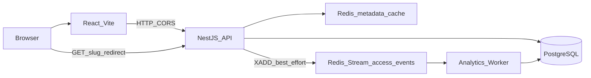

# System Design

Arquitetura **realmente implementada** neste repositório. Detalhes de contrato e trade-offs longos ficam no [README](../../README.MD) e nos [ADRs](../adr/).

## Overview

PostgreSQL (fonte de verdade):

- `links` — metadata + `clickCount`
- `access_events` — fatos individuais (`eventId` UNIQUE)
- `daily_link_stats` — agregados diários por link

Redis:

- cache-aside `link:{slug}` (metadata **sem** `clickCount`)
- Stream `access_events` + consumer group `analytics-workers`
- rate limit `POST /links`

Processos Compose: `web`, `api`, `worker`, `postgres`, `redis`.

## Critical Path

`GET /:slug` é o hot path:

1. Lookup cache Redis (miss → PostgreSQL → set cache).
2. Validar `active` / `expiresAt` / existência.
3. **Unlimited:** autorizar sem write síncrono de contador; enqueue analytics; `302`.
4. **Capped:** `UPDATE` atômico no PostgreSQL; sucesso → enqueue com `preCounted`; senão `410`.
5. Resposta `302 Found` (nunca permanente).

O redirect **não espera** persistência de analytics.

## Cache Strategy

- Cache-aside de metadata para reduzir pressão no PG em links quentes.
- PostgreSQL permanece source of truth de metadata e de `maxClicks` / `clickCount`.
- `PATCH` disable: atualiza PG e **DEL** obrigatório da key (invalidação imediata).
- TTL auxilia performance; **não** é mecanismo de correctness para disable.

## maxClicks

Ver [ADR-002](../adr/002-maxclicks-postgresql-authority.md).

- Links capped: enforcement exclusivo no PostgreSQL (`clickCount < maxClicks` + active/expiry).
- Redis **não** é autoridade de limite.
- Unlimited: sem esse `UPDATE` no hot path; worker incrementa `clickCount` após o evento.

## Analytics

Ver [ADR-003](../adr/003-analytics-redis-streams.md) e [ADR-001](../adr/001-access-stats-aggregation.md).

- Redirect publica no Stream (best-effort, non-blocking por padrão).
- Worker: consumer group → transação idempotente (`eventId`) → `AccessEvent` + `DailyLinkStat` (+ `clickCount` se não `preCounted`) → **ACK após COMMIT**.
- At-least-once pós-aceite; dedup por `eventId`.
- Poison → DLQ após tentativas máximas.
- Stats e totais podem refletir **consistência eventual** enquanto o worker processa.

## Statistics

`GET /links/:slug/stats` (somente PG, sem Redis):

1. `Link` por slug → `totalClicks` = `clickCount` (nunca `COUNT(AccessEvent)`).
2. `DailyLinkStat` na janela UTC de 7 dias + zero-fill.
3. `AccessEvent` `ORDER BY accessedAt DESC LIMIT 20`.

`GET /links` lista os 50 mais recentes (`createdAt DESC`) para a UI.

## Rate Limiting

Somente `POST /links`, fixed window no Redis por IP. Redis down → **fail-open** na criação. `GET /:slug` não é limitado.

## Failure Behavior

### Cache failure

Redis indisponível para leitura/escrita de **metadata** (`link:{slug}`):

- a API faz **fallback para PostgreSQL** quando aplicável (miss/erro de cache não inventa autoridade);
- PostgreSQL continua sendo a **source of truth** de metadata e regras de disponibilidade.

Disable ainda exige invalidação Redis quando possível; falha de `DEL` após PG `active=false` → `503` (retry sem reativar).

### Analytics enqueue failure

Falha ao publicar o access event no Redis Stream:

- **não impede o redirect** — o `302` permanece prioritário;
- decisão consciente: logging/analytics não podem comprometer latência/disponibilidade do hot path (requisito do desafio).

Eventos **aceitos** pelo Stream:

- processamento assíncrono pelo worker (consumer group);
- `eventId` garante idempotência no PostgreSQL;
- ACK ocorre **depois** do commit da TX;
- leituras de stats/`clickCount` podem ficar temporariamente atrás (eventual consistency).

Worker down: stream acumula; redirects continuam.

## Trade-offs

- Sem autenticação: `GET /links` é lista global dos 50 mais recentes.
- Agregados denormalizados vs risco de divergência temporária (aceitável; ADR-001).
- Índice em `AccessEvent (linkId, accessedAt DESC)` para LIMIT 20; sem índice em `createdAt` na listagem auxiliar (Seq Scan + LIMIT 50, revisitável se a tabela crescer).
- Rate limit fail-open: proteção, não fonte de verdade.

## Out of Scope / Possible Evolution

**Não implementado** (e não necessário para o desafio): Kubernetes, cloud gerenciada, réplicas, cluster Redis/PG, CDN, autenticação, CI/CD, microserviços, Kafka.

Possíveis evoluções futuras (fora desta entrega): HA, multi-instância API, retenção/arquivamento de eventos, observabilidade avançada. A aplicação atual não depende desses componentes.
